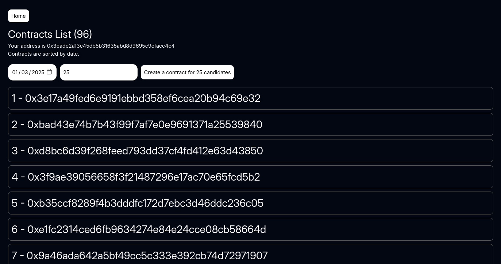
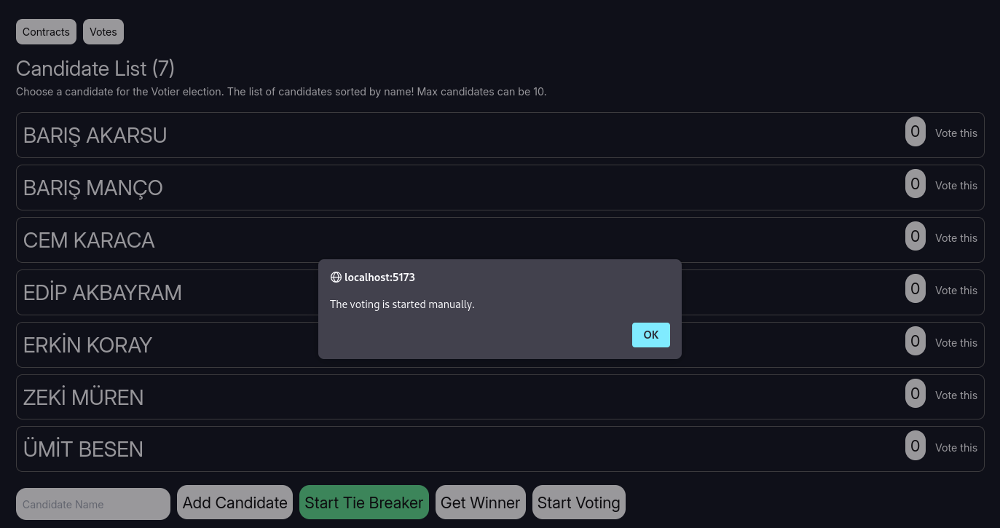
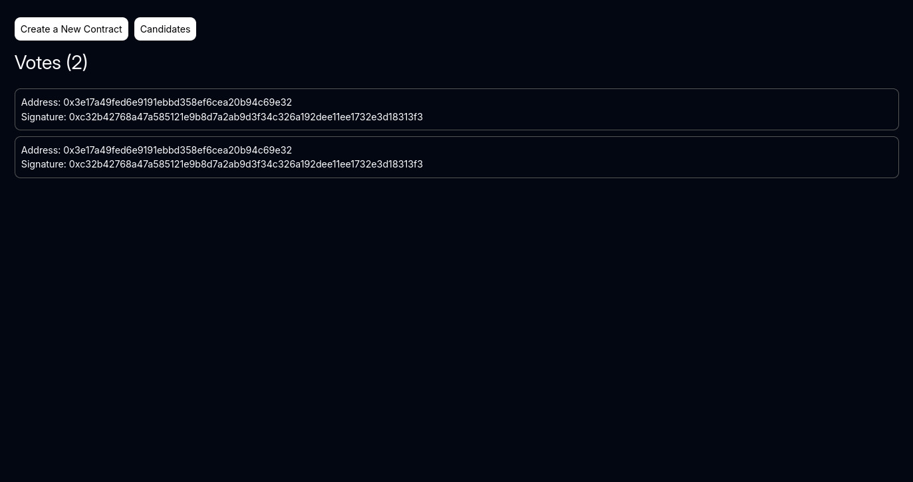

# Votier - Blockchain Voting App

Welcome to the **Blockchain Voting App**! This decentralized application (dApp) allows secure and transparent voting using blockchain technology. It consists of a frontend built with **React Remix** and smart contracts written in **Solidity**.

## Features

- Transparent Voting Process: All votes are recorded on the blockchain for tamper-proof integrity.
- Smart Contract Logic: Includes modifiers, events, and functions to ensure a secure and efficient voting mechanism.
- User-Friendly Interface: Built with React Remix for a seamless user experience.

## Project Structure

- **app**: Contains the frontend application code built with React Remix.
- **smart-contracts**: Contains the Solidity smart contracts managing the voting process.

## Installation and Setup

### Prerequisites

- Node.js
- npm or yarn
- Solidity compiler
- Local blockchain environment (e.g., Ganache, Hardhat)

### Steps

1. Clone the repository:

    ```bash
    git clone https://github.com/ofcskn/Votier.git
    cd Votier
    ```

2. Install dependencies for the frontend:

    ```bash
    cd app
    npm install
    ```

3. Compile the smart contracts:

    ```bash
    cd ../smart-contracts
    truffle migrate --network development
    ```

4. Deploy the smart contracts:

    ```bash
    truffle deploy --reset --network development
    ```

5. Update the contract address in the frontend:

    - Locate the configuration file in the `Votier` folder (e.g., `.env`) and update it.

6. Start the frontend application:

    ```bash
    cd ../app
    npx remix vite:dev
    ```

7. Access the application at `http://localhost:<your-port>`.

## Smart Contract Overview

The smart contracts are designed with the following key components:

### Modifiers

#### Modifiers Description

- `onlyAdmin`  
  Restricts access to admin-only functions. Ensures that only the admin can perform specific actions.

- `hasNotVoted`  
  Prevents voters from casting multiple votes. Ensures that a voter has not already voted.

- `hasNotVotedForTie`  
  Ensures a voter has not already participated in the tie-breaking step.

- `votingOpen`  
  Ensures that the voting period is active and no tie-breaker is ongoing.

- `votingEnded`  
  Ensures that the voting period has concluded. For tie-breaker cases, checks the specific time conditions.

- `votingTieBreakerOpen`  
  Ensures that the tie-breaker voting period is active.

- `tieBreakerActive`  
  Ensures that a tie-breaker process is currently active.

- `votingStarted`  
  Checks if the voting process has been initiated.

- `votingNotStarted`  
  Ensures that the voting process has not been manually started by the admin.

### Events

- Emit events for critical actions such as vote casting and result declarations.

#### Events Description

- `CandidateAdded`  
  Emitted when a new candidate is added to the election. Includes the candidate's ID and name.

- `Voted`  
  Emitted when a vote is cast. Includes the voter's address, the candidate ID they voted for, the time of voting, and the updated vote count.

- `AdminInitialized`  
  Debugging event emitted when the admin is initialized.

- `ContractDeployed`  
  Debugging event emitted when the contract is deployed, with a message.

- `WinnerDeclared`  
  Emitted when the exact winner of the election is declared, including the candidate ID of the winner.

### Functions

### Functions Description

- `startVoting`  
  Starts the voting process. Only the admin can call this function, and it can only be called if the voting has not yet started.
  
- `endVoting`  
  Ends the voting process. Only the admin can call this function, and it can only be called if the voting has already started.
  
- `getAllCandidates`  
  Retrieves all candidates in the election by iterating through the `candidatesCount`. Returns an array of all candidates.
  
- `addCandidate`  
  Allows the admin to add a new candidate to the voting system. Ensures that the name is not empty, not already used, and that the maximum candidate count has not been reached.
  
- `vote`  
  Allows a user to vote for a candidate. If the tie-breaker round is active, the vote is cast in the tie-breaker; otherwise, the vote is cast in the main round.

- `voteInFirst`  
  Allows a user to vote in the main voting round. Prevents a user from voting more than once and updates the vote count of the chosen candidate.

- `voteInTieBreaker`  
  Allows a user to vote in the tie-breaker round. Ensures that the candidate is part of the tied candidates and prevents multiple votes for the tie-breaker.

- `startTieBreaker`  
  Starts the tie-breaker round if there are candidates with equal votes. Marks candidates as tied and sets up the voting duration for the tie-breaker round.

- `getWinner`  
  Declares the winner after the voting process (either regular or tie-breaker). The winner is the candidate with the highest vote count. Returns the winner's ID, name, and vote count.

## Screenshots

Here are some screenshots of the application:






## Contributing

Contributions are welcome! Please fork the repository and submit a pull request with your changes.

## License

This project is licensed under the MIT License. See the [LICENSE](LICENSE) file for details.

## Contact

For any questions or feedback, feel free to reach out:

- Email: info@ofcskn.com
- GitHub: [ofcskn](https://github.com/ofcskn)
- Linkedin: [Linkedin](https://linkedin.com/in/ofcskn)

Enjoy using the **Votier - Blockchain Voting App**!
